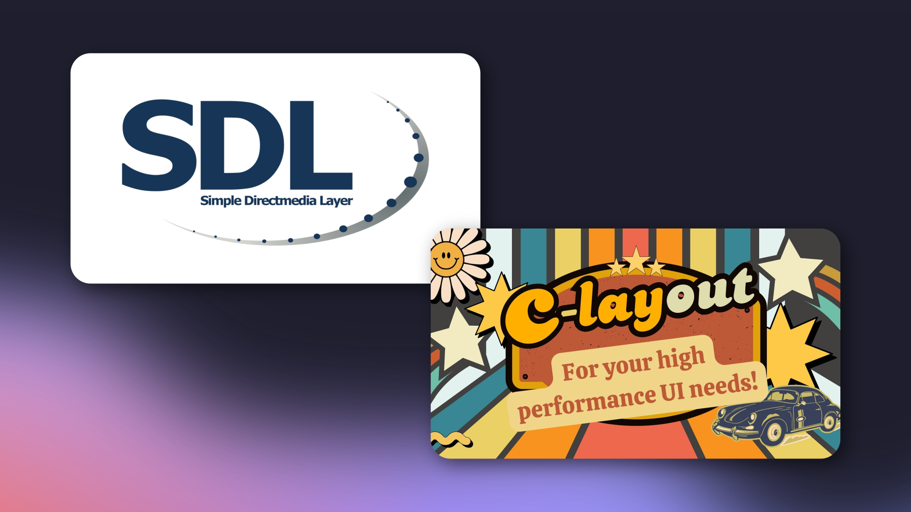

# Fun with SDL3 and Clay

This repo follows my blog posts ([part 1](https://dylancobb.dev/blog/clay-sdl-setup-1/), [part 2](https://dylancobb.dev/blog/clay-sdl-setup-2/), [part 3](https://dylancobb.dev/blog/clay-sdl-setup-3/)) about setting up SDL3 and Clay, rendering some basic UI, and building to both a desktop application and WebAssembly with CMake.

Feel free to use this as a template to start your own SDL3 + Clay project. You'll need to install [`SDL3`](https://github.com/libsdl-org/SDL) and [`SDL3_ttf`](https://github.com/libsdl-org/SDL_ttf) before using the below commands to build the application.

## Fresh build commands

```bash
# Desktop
cmake -S . -B build-desktop
cmake --build build-desktop

# WASM
emcmake cmake -S . -B build-wasm
cmake --build build-wasm
```

## Rebuild commands

```bash
## Desktop
cd build-desktop
make -j$(nproc)

## WASM
cd build-wasm
make -j$(nproc)
```

## Running WASM build

```bash
python3 -m http.server
```
